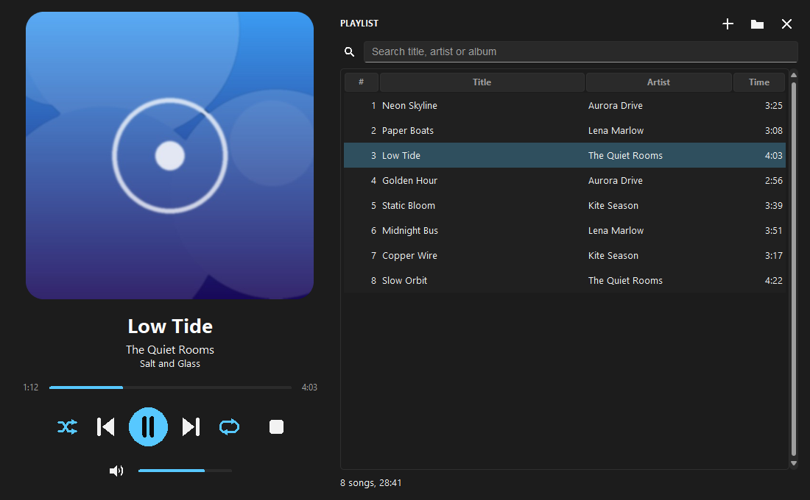
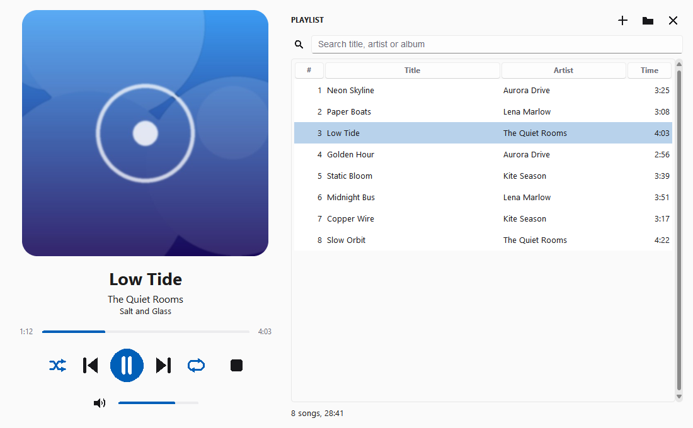
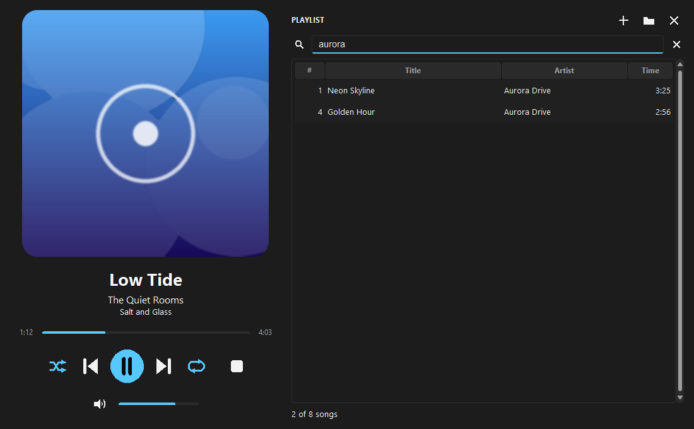
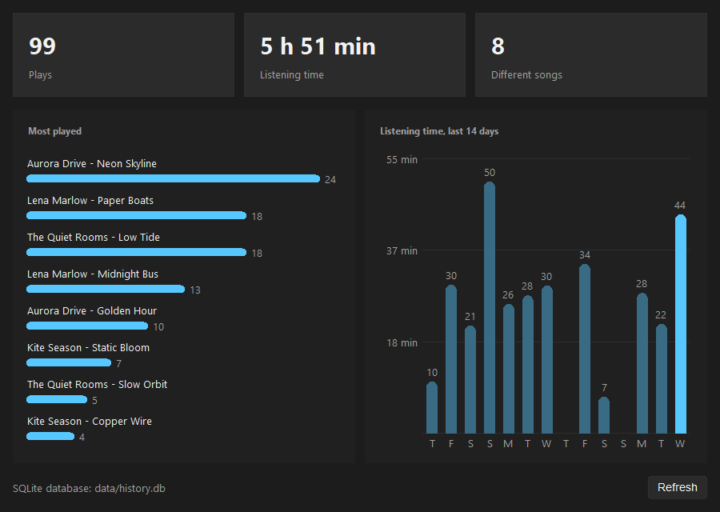

# Music Player

This is our project for the Advanced Programming (Programação Avançada) course. It is a desktop music player written in Python with tkinter for the window and pygame for the audio. It shows the cover art and the tags of the song that is playing, keeps a play history in SQLite, a text file or SQL Server, and draws statistics about what we listen to.

| Dark theme | Light theme |
|---|---|
|  |  |

## Features

- Modern two panel window that can be resized: the song that is playing on the left, the playlist on the right. Dark theme by default and a light theme, switched with one click and remembered.
- Now playing panel with the cover art embedded in the file (or a generated cover when there is none), title, artist, album, elapsed and total time.
- Play, pause, stop, next, previous, a seek bar and a volume slider with mute. The buttons are drawn on a canvas and react to the mouse.
- The next song starts by itself when one ends. Shuffle and repeat (off, all, one).
- Playlist with search: type part of a title, artist or album and the list is filtered while you type.
- Add songs or a whole folder, remove songs, save and open playlists as M3U files.
- The last playlist, selected song, volume, theme and window position come back the next time the player starts.
- Keyboard shortcuts for the common actions (see the table below).
- Play history that can be stored in SQLite (default, works out of the box), in a text file or in a SQL Server table, chosen in the settings.
- Statistics window: most played songs and listening time per day, from the history that is in use.
- Automated tests for everything that does not need a window or a sound card, run by GitHub Actions on every push.



## Requirements

- Python 3 with tkinter (included in the standard Windows installer). The automated tests run on Python 3.12.
- The libraries in `requirements.txt`: `pygame` (audio), `mutagen` (tags and cover art), `pillow` (images), `sv-ttk` (the Sun Valley ttk theme) and `pyodbc` (only used by the SQL Server history).
- For the SQL Server history only: a SQL Server database and an ODBC driver on the computer.

## Quick start

```
pip install -r requirements.txt
python run.py
```

`python -m music_player` also works when it is started from the `src` folder. Use the `+` button (or Ctrl+O) to add songs and double click a song to play it. MP3, WAV, OGG, FLAC and M4A files are accepted, as long as pygame can decode them. The `music/` folder is a convenient place for your own files; it is ignored by git.

## Usage

### Keyboard shortcuts

| Key | Action |
|---|---|
| Space | Play or pause |
| Left / Right | Previous / next song |
| Up / Down | Volume up / down |
| M | Mute or unmute |
| S | Shuffle on or off |
| R | Repeat: off, all, one |
| Ctrl+O / Ctrl+Shift+O | Add songs / add a folder |
| Ctrl+F | Search the playlist |
| Delete | Remove the selected song |
| Ctrl+, | Settings |

When the focus is in the playlist table the arrows move the selection, so use Ctrl+arrows there. The full list is in Help, Keyboard shortcuts.

### Play history and statistics

Every song that starts is recorded with its date, time and length. History, View play history shows the list and History, Statistics shows the charts. File, Settings chooses where the history is stored:

| Storage | Where | Notes |
|---|---|---|
| SQLite (default) | `data/history.db` | Nothing to install or configure |
| Text file | `data/history.txt` | One tab separated line per play |
| SQL Server | the database in `db_config.ini` | See below |

For SQL Server, copy `db_config.example.ini` to `db_config.ini` and fill in the driver, server, database, user and password. `db_config.ini` is ignored by git, so the credentials stay on your computer. The player creates the `music_history` table the first time it connects (`sql/create_music_history.sql` has the same table if you prefer to create it by hand). If the connection fails, the settings dialog keeps the previous storage and shows the reason.



The settings, the SQLite database and the text history live in the git-ignored `data/` folder next to the program. Set the environment variable `MUSIC_PLAYER_DATA` to use another folder.

## Tests

```
pip install -r requirements-dev.txt
python -m pytest
```

The tests cover the playlist logic (next, previous, shuffle, repeat, filter), M3U files, the tag reader, the settings file, the audio player (with a fake mixer), the three history backends (SQLite, text file and SQL Server through a fake connection) and the statistics. They need no display, no sound card and no database server. The workflow in `.github/workflows/ci.yml` compiles every Python file and runs the tests on Ubuntu for each push.

## Project structure

```
tkinter-music-player/
|-- run.py                       starts the player
|-- src/music_player/
|   |-- app.py                   main window and the playback controls
|   |-- player.py                pygame mixer wrapper (state, position, end of song)
|   |-- playlist.py              songs, next and previous, shuffle, repeat, filter
|   |-- m3u.py                   save and open M3U playlists
|   |-- metadata.py              tags and cover art with mutagen
|   |-- config.py                paths and the JSON settings
|   |-- theme.py, widgets.py     dark and light theme, canvas buttons, slider, cover
|   |-- history_window.py        play history window
|   |-- stats_window.py          statistics window
|   |-- settings_dialog.py       settings dialog
|   `-- history/                 base interface, text, SQLite and SQL Server backends, statistics
|-- tests/                       pytest tests
|-- assets/images/icon.ico       window icon
|-- docs/                        project report (Word and English version) and screenshots
|-- sql/create_music_history.sql table used by the SQL Server history
|-- db_config.example.ini        template for the SQL Server settings
|-- music/                       put your own songs here (ignored by git)
`-- requirements.txt, requirements-dev.txt
```

## How it works

- `AudioPlayer` wraps `pygame.mixer.music` and keeps the state (stopped, playing, paused). pygame only reports the time since playback started, so the player adds the offset of the last seek and freezes the position while paused. A song is finished when the mixer stops being busy while the state is playing.
- A timer started with `after` runs five times per second: it moves the seek bar, updates the times and asks the player whether the song ended. When it did, the playlist chooses the next song according to shuffle and repeat.
- `Playlist` holds the songs and the current one. With shuffle on it walks a shuffled order in which every song is played once per round. The search box only filters what is shown, the songs keep their real position.
- `metadata.py` reads title, artist, album, length and the embedded picture; files without tags use the file name.
- The history backends share one small interface (`record`, `entries`, `clear`), so the windows and the statistics do not care where the data is stored. The statistics are plain functions over the list of entries.
- The theme is the Sun Valley ttk theme with a palette on top. The buttons, sliders and the cover are drawn on canvases and redraw themselves when the theme changes.

## Team

- Tiago Cabaça (81744)
- Francisco Diniz (81809)

## Course

Programação Avançada (Advanced Programming), 2nd semester of the CTeSP (Curso Técnico Superior Profissional) in Informatics at AESM, Academia de Ensino Superior de Mafra, academic year 2021/2022.

## Documentation

The project report is in the `docs` folder: the Portuguese Word document and an English version in [docs/REPORT.md](docs/REPORT.md).
